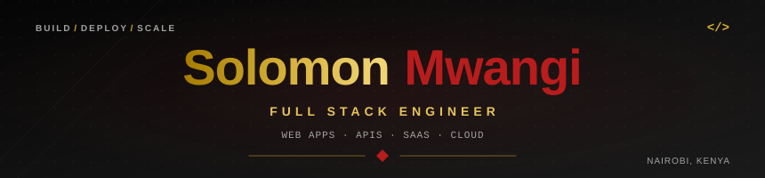

<div align="center">




<br/>

<a href="https://github.com/Losomon">
  
</a>
<a href="https://linkedin.com/in/solomonmwangi">
  
</a>
<a href="https://twitter.com/solomonmwangi">
  
</a>
<a href="https://my-portfolio-v51.vercel.app">
  
</a>
<a href="mailto:solomboni5@gmail.com">
  
</a>


</div>

<br/>

---

## 👨‍💻 About Me

```typescript
const solomon = {
  name: "Solomon Mwangi",
  location: "Nairobi, Kenya 🇰🇪",

  roles: [
    "Full Stack Engineer",
    "UI/UX Designer",
    "SaaS Builder"
  ],

  currentlyBuilding:
    "🏥 Hospital Management System (SaaS)",

  currentlyLearning: [
    "System Design",
    "3D Web",
    "Three.js",
    "WebGL"
  ],

  focus: [
    "Web Applications",
    "REST APIs",
    "Database Architecture",
    "SaaS Platforms",
    "Cloud & Deployment"
  ],

  philosophy:
    "Build useful software. Keep the architecture clean. Make the experience simple."
};
```

I enjoy building software across the full stack — from interfaces and APIs to databases, authentication, business logic, dashboards, and deployment.

My goal is to turn real-world problems into **reliable, maintainable and scalable software**.

---

## 🛠️ Tech Stack

<div align="center">

### Frontend


### Backend


### Databases & Cloud


### Tools & DevOps


</div>

---

## 🚀 Featured Projects

<div align="center">

<table>
<tr>

<td width="50%" valign="top">

<h3 align="center">📈 Binary Trading Platform</h3>

<div align="center">

<a href="https://github.com/Losomon/binary-trading-platform">
  
</a>

</div>

**A real-time trading system focused on market data, trade workflows and analytics.**

* 📊 Live market data and real-time price updates
* ⚡ Trade execution workflows
* 🔐 Authentication and wallet functionality
* 📉 Trading analytics dashboard
* 🔌 WebSocket-based real-time communication
* 🗄️ PostgreSQL-backed architecture


<br/>

<a href="https://github.com/Losomon/binary-trading-platform">
  
</a>

</td>

<td width="50%" valign="top">

<h3 align="center">🏨 Coconut Saraih Hotel — SaaS</h3>

<div align="center">

<a href="https://github.com/Losomon/coconut-saraih-hotel">
  
</a>

</div>

**A hospitality platform designed to streamline hotel operations.**

* 🛎️ Room booking and reservation management
* 👥 Guest check-in and check-out workflows
* 💳 Billing, invoicing and payment tracking
* 📊 Administrative and occupancy insights
* 🏗️ Multi-property SaaS architecture


<br/>

<a href="https://github.com/Losomon/coconut-saraih-hotel">
  
</a>

</td>

</tr>
</table>

</div>

---

## 🏗️ Engineering Focus

| Area            | Focus                                                  |
| --------------- | ------------------------------------------------------ |
| 🎨 UI/UX        | Clean, responsive and intuitive interfaces             |
| 🧩 Architecture | Maintainable and scalable application structure        |
| 🔐 Security     | Authentication, authorization and secure data handling |
| ⚡ Performance   | Efficient APIs, queries and frontend experiences       |
| 🗄️ Data        | Database design, persistence and data modeling         |
| ☁️ Cloud        | Deployment, hosting and production workflows           |
| 📊 SaaS         | Business workflows and multi-tenant systems            |
| 🔌 APIs         | RESTful services and system integrations               |

---

## 📊 GitHub Statistics

<div align="center">


<br/><br/>


<br/><br/>


</div>

---

## 🐍 Contribution Activity

<div align="center">

<picture>
  <source
    media="(prefers-color-scheme: dark)"
    srcset="https://raw.githubusercontent.com/Losomon/Losomon/output/github-contribution-grid-snake-dark.svg"
  />

<source
 media="(prefers-color-scheme: light)"
 srcset="https://raw.githubusercontent.com/Losomon/Losomon/output/github-contribution-grid-snake.svg"
/>

 </picture>

</div>

---

## 🎯 Current Focus

```text
SYSTEM DESIGN
      ↓
SCALABLE APIS
      ↓
DATABASE ARCHITECTURE
      ↓
SAAS SYSTEMS
      ↓
CLOUD & DEPLOYMENT
      ↓
PRODUCTION SOFTWARE
```

I'm continuously improving how I design, build, test and deploy software that can grow beyond a prototype.

---

## 🌍 Building From Africa, For the World

<div align="center">

> **"The best technology solves the problem in the room, not just the one on the whiteboard."**

**— Solomon Mwangi · Nairobi, Kenya 🇰🇪**

</div>

---

<div align="center">


<br/>

<sub>
⭐ Star a repository if you find it useful ·
<a href="https://my-portfolio-v51.vercel.app">Visit Portfolio</a>
</sub>

</div>
